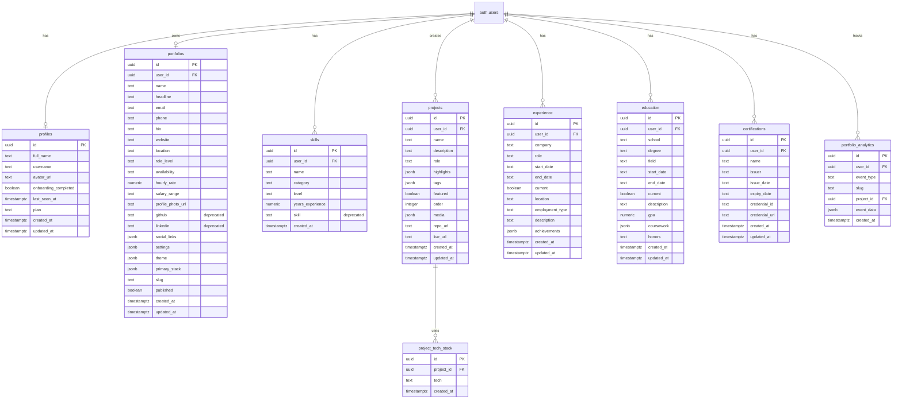

# Database Documentation

## Overview

This document provides comprehensive database documentation for QwikFolio v1, including entity relationships, data dictionary, indexing strategies, migration history, and maintenance procedures.

**Last Updated**: January 2025  
**Database**: PostgreSQL (Supabase)  
**Version**: v1.0.0

---

## Table of Contents

1. [Entity Relationship Diagram (ERD)](#entity-relationship-diagram-erd)
2. [Data Dictionary](#data-dictionary)
3. [Indexing & Performance Strategy](#indexing--performance-strategy)
4. [Migration Audit (Beta to v1)](#migration-audit-beta-to-v1)
5. [Maintenance & Security](#maintenance--security)

---

## Entity Relationship Diagram (ERD)

### Visual Schema Map



### Relationship Summary

| Relationship | Type | Description |
|--------------|------|-------------|
| `auth.users` → `profiles` | One-to-One | Each user has one profile |
| `auth.users` → `portfolios` | One-to-One | Each user has one portfolio |
| `auth.users` → `skills` | One-to-Many | Each user has many skills |
| `auth.users` → `projects` | One-to-Many | Each user has many projects |
| `auth.users` → `experience` | One-to-Many | Each user has many experience entries |
| `auth.users` → `education` | One-to-Many | Each user has many education entries |
| `auth.users` → `certifications` | One-to-Many | Each user has many certifications |
| `auth.users` → `portfolio_analytics` | One-to-Many | Each user has many analytics events |
| `projects` → `project_tech_stack` | One-to-Many | Each project has many tech stack items |
| `projects` → `portfolio_analytics` | One-to-Many | Each project can have many view events |

---

## Data Dictionary

### Core Tables

#### `portfolios`

Primary portfolio data table. Stores one record per user with all personal information and portfolio settings.

| Field Name | Type | Constraints | Default | Description |
|------------|------|------------|--------|-------------|
| `id` | UUID | PRIMARY KEY, NOT NULL | `gen_random_uuid()` | Unique portfolio identifier |
| `user_id` | UUID | NOT NULL, UNIQUE, FK → `auth.users(id)` | - | Owner user ID (CASCADE DELETE) |
| `name` | TEXT | NOT NULL, CHECK `char_length >= 1` | - | Full name |
| `headline` | TEXT | NOT NULL, CHECK `char_length >= 1` | - | Professional headline |
| `email` | TEXT | NOT NULL | - | Contact email (PII) |
| `phone` | TEXT | NULL | NULL | Phone number (PII) |
| `bio` | TEXT | NULL | NULL | Bio/description |
| `website` | TEXT | NULL | NULL | Personal website URL |
| `location` | TEXT | NULL | NULL | City, country (added in v1) |
| `role_level` | TEXT | NULL, CHECK `IN ('junior', 'mid', 'senior', 'lead')` | NULL | Role level (added in v1) |
| `availability` | TEXT | NULL, CHECK `IN ('open_to_work', 'freelance', 'not_open')` | NULL | Availability status (added in v1) |
| `hourly_rate` | NUMERIC(10,2) | NULL | NULL | Hourly rate for freelance (added in v1) |
| `salary_range` | TEXT | NULL | NULL | Salary range for open_to_work (added in v1) |
| `profile_photo_url` | TEXT | NULL | NULL | Profile photo URL (added in v1) |
| `github` | TEXT | NULL | NULL | **DEPRECATED** - Use `social_links` |
| `linkedin` | TEXT | NULL | NULL | **DEPRECATED** - Use `social_links` |
| `social_links` | JSONB | NULL | `[]` | Array of `{type, url}` objects (added in v1) |
| `settings` | JSONB | NULL | `{"isPublic": false, "showContactForm": true}` | Portfolio settings (added in v1) |
| `theme` | JSONB | NULL | `{"id": "emerald", ...}` | Theme configuration (added in v1) |
| `primary_stack` | JSONB | NULL | `[]` | Array of skill names for highlighting (added in v1) |
| `slug` | TEXT | NULL, UNIQUE (partial index) | NULL | Custom URL slug (added in v1) |
| `published` | BOOLEAN | NOT NULL | `false` | Published status (synced with `settings.isPublic`) |
| `created_at` | TIMESTAMPTZ | NOT NULL | `NOW()` | Creation timestamp |
| `updated_at` | TIMESTAMPTZ | NOT NULL | `NOW()` | Last update timestamp (auto-updated) |

**Indexes**:
- Primary key on `id`
- Unique index on `user_id`
- Unique partial index on `slug` (WHERE slug IS NOT NULL)
- Index on `slug` for lookups
- Index on `user_id` for joins

**RLS Policies**:
- Users can SELECT/INSERT/UPDATE/DELETE their own portfolio
- Public can SELECT if `published=true` OR `settings->>'isPublic'='true'`

**PII Fields**: `email`, `phone`

---

#### `profiles`

User profile metadata (Supabase auth extension).

| Field Name | Type | Constraints | Default | Description |
|------------|------|------------|--------|-------------|
| `id` | UUID | PRIMARY KEY, FK → `auth.users(id)` | - | User ID (matches auth.users) |
| `full_name` | TEXT | NULL | NULL | Full name |
| `username` | TEXT | NULL, UNIQUE | NULL | Username for public URLs |
| `avatar_url` | TEXT | NULL | NULL | Avatar image URL |
| `onboarding_completed` | BOOLEAN | NOT NULL | `false` | Onboarding completion status |
| `last_seen_at` | TIMESTAMPTZ | NULL | NULL | Last activity timestamp |
| `plan` | TEXT | NOT NULL, CHECK `IN ('free', 'pro')` | `'free'` | Subscription plan |
| `created_at` | TIMESTAMPTZ | NOT NULL | `NOW()` | Creation timestamp |
| `updated_at` | TIMESTAMPTZ | NOT NULL | `NOW()` | Last update timestamp |

**Indexes**:
- Primary key on `id`
- Unique index on `username`

**RLS Policies**:
- Users can SELECT/UPDATE their own profile
- Public can SELECT profiles (for username lookup)

**PII Fields**: `full_name`, `username`

---

#### `skills`

Structured skills data. Migrated from simple TEXT to structured format in v1.

| Field Name | Type | Constraints | Default | Description |
|------------|------|------------|--------|-------------|
| `id` | UUID | PRIMARY KEY, NOT NULL | `gen_random_uuid()` | Unique skill identifier |
| `user_id` | UUID | NOT NULL, FK → `auth.users(id)` | - | Owner user ID (CASCADE DELETE) |
| `name` | TEXT | NOT NULL, CHECK `char_length >= 2` | - | Skill name (e.g., "React") |
| `category` | TEXT | NOT NULL, CHECK `IN ('language', 'framework', 'tool', 'soft_skill')` | - | Skill category (added in v1) |
| `level` | TEXT | NOT NULL, CHECK `IN ('beginner', 'intermediate', 'advanced')` | - | Proficiency level (added in v1) |
| `years_experience` | NUMERIC(3,1) | NULL | NULL | Years of experience (added in v1) |
| `skill` | TEXT | NULL | NULL | **DEPRECATED** - Use `name` (kept for backward compatibility) |
| `created_at` | TIMESTAMPTZ | NOT NULL | `NOW()` | Creation timestamp |

**Indexes**:
- Primary key on `id`
- Unique constraint on `(user_id, name)`
- Index on `user_id` for user queries
- Index on `category` for filtering
- Index on `level` for filtering
- Composite index on `(user_id, category)` for grouped queries

**RLS Policies**:
- Users can SELECT/INSERT/UPDATE/DELETE their own skills
- Public can SELECT if portfolio is published

---

#### `projects`

Project portfolio entries with enhanced metadata in v1.

| Field Name | Type | Constraints | Default | Description |
|------------|------|------------|--------|-------------|
| `id` | UUID | PRIMARY KEY, NOT NULL | `gen_random_uuid()` | Unique project identifier |
| `user_id` | UUID | NOT NULL, FK → `auth.users(id)` | - | Owner user ID (CASCADE DELETE) |
| `name` | TEXT | NOT NULL, CHECK `char_length >= 2` | - | Project name |
| `description` | TEXT | NOT NULL, CHECK `char_length >= 10` | - | Project description |
| `role` | TEXT | NULL | NULL | Role in project (added in v1) |
| `highlights` | JSONB | NULL | `[]` | Array of highlight strings (added in v1) |
| `tags` | JSONB | NULL | `[]` | Array of tag strings (added in v1) |
| `featured` | BOOLEAN | NOT NULL | `false` | Featured project flag (added in v1) |
| `order` | INTEGER | NOT NULL | `0` | Display order for sorting (added in v1) |
| `media` | JSONB | NULL | `[]` | Array of `{type, url}` objects (added in v1) |
| `repo_url` | TEXT | NULL | NULL | Repository URL |
| `live_url` | TEXT | NULL | NULL | Live demo URL |
| `created_at` | TIMESTAMPTZ | NOT NULL | `NOW()` | Creation timestamp |
| `updated_at` | TIMESTAMPTZ | NOT NULL | `NOW()` | Last update timestamp (auto-updated) |

**Indexes**:
- Primary key on `id`
- Index on `user_id` for user queries
- Composite index on `(user_id, featured)` for featured projects
- Composite index on `(user_id, order)` for sorted queries

**RLS Policies**:
- Users can SELECT/INSERT/UPDATE/DELETE their own projects
- Public can SELECT if portfolio is published

---

#### `project_tech_stack`

Junction table for project technologies (many-to-many relationship).

| Field Name | Type | Constraints | Default | Description |
|------------|------|------------|--------|-------------|
| `id` | UUID | PRIMARY KEY, NOT NULL | `gen_random_uuid()` | Unique tech stack entry ID |
| `project_id` | UUID | NOT NULL, FK → `projects(id)` | - | Project ID (CASCADE DELETE) |
| `tech` | TEXT | NOT NULL | - | Technology name |
| `created_at` | TIMESTAMPTZ | NOT NULL | `NOW()` | Creation timestamp |

**Indexes**:
- Primary key on `id`
- Unique constraint on `(project_id, tech)`
- Index on `project_id` for project queries

**RLS Policies**:
- Users can SELECT/INSERT/UPDATE/DELETE tech stack for their own projects
- Public can SELECT if portfolio is published

---

#### `experience`

Work experience entries with enhanced fields in v1.

| Field Name | Type | Constraints | Default | Description |
|------------|------|------------|--------|-------------|
| `id` | UUID | PRIMARY KEY, NOT NULL | `gen_random_uuid()` | Unique experience entry ID |
| `user_id` | UUID | NOT NULL, FK → `auth.users(id)` | - | Owner user ID (CASCADE DELETE) |
| `company` | TEXT | NOT NULL, CHECK `char_length >= 2` | - | Company name |
| `role` | TEXT | NOT NULL, CHECK `char_length >= 2` | - | Job title |
| `start_date` | TEXT | NOT NULL | - | Start date (YYYY-MM format) |
| `end_date` | TEXT | NULL | NULL | End date (YYYY-MM format) |
| `current` | BOOLEAN | NOT NULL | `false` | Currently working here |
| `location` | TEXT | NULL | NULL | Job location (added in v1) |
| `employment_type` | TEXT | NULL, CHECK `IN ('full_time', 'contract', 'internship')` | NULL | Employment type (added in v1) |
| `description` | TEXT | NULL | NULL | Job description (made optional in v1) |
| `achievements` | JSONB | NULL | `[]` | Array of achievement strings (added in v1) |
| `created_at` | TIMESTAMPTZ | NOT NULL | `NOW()` | Creation timestamp |
| `updated_at` | TIMESTAMPTZ | NOT NULL | `NOW()` | Last update timestamp (auto-updated) |

**Indexes**:
- Primary key on `id`
- Index on `user_id` for user queries
- Composite index on `(user_id, employment_type)` for filtering

**RLS Policies**:
- Users can SELECT/INSERT/UPDATE/DELETE their own experience
- Public can SELECT if portfolio is published

---

#### `education`

Education entries with enhanced fields in v1.

| Field Name | Type | Constraints | Default | Description |
|------------|------|------------|--------|-------------|
| `id` | UUID | PRIMARY KEY, NOT NULL | `gen_random_uuid()` | Unique education entry ID |
| `user_id` | UUID | NOT NULL, FK → `auth.users(id)` | - | Owner user ID (CASCADE DELETE) |
| `school` | TEXT | NOT NULL, CHECK `char_length >= 2` | - | School name |
| `degree` | TEXT | NOT NULL, CHECK `char_length >= 2` | - | Degree type |
| `field` | TEXT | NOT NULL, CHECK `char_length >= 2` | - | Field of study |
| `start_date` | TEXT | NOT NULL | - | Start date (YYYY-MM format) |
| `end_date` | TEXT | NULL | NULL | End date (YYYY-MM format) |
| `current` | BOOLEAN | NOT NULL | `false` | Currently enrolled |
| `description` | TEXT | NULL | NULL | Additional description |
| `gpa` | NUMERIC(3,2) | NULL, CHECK `>= 0 AND <= 4.0` | NULL | GPA (0-4.0 scale) (added in v1) |
| `coursework` | JSONB | NULL | `[]` | Array of course names (added in v1) |
| `honors` | TEXT | NULL | NULL | Honors/awards (added in v1) |
| `created_at` | TIMESTAMPTZ | NOT NULL | `NOW()` | Creation timestamp |
| `updated_at` | TIMESTAMPTZ | NOT NULL | `NOW()` | Last update timestamp (auto-updated) |

**Indexes**:
- Primary key on `id`
- Index on `user_id` for user queries

**RLS Policies**:
- Users can SELECT/INSERT/UPDATE/DELETE their own education
- Public can SELECT if portfolio is published

---

#### `certifications`

Professional certifications (new table in v1).

| Field Name | Type | Constraints | Default | Description |
|------------|------|------------|--------|-------------|
| `id` | UUID | PRIMARY KEY, NOT NULL | `gen_random_uuid()` | Unique certification ID |
| `user_id` | UUID | NOT NULL, FK → `auth.users(id)` | - | Owner user ID (CASCADE DELETE) |
| `name` | TEXT | NOT NULL, CHECK `char_length >= 2` | - | Certification name |
| `issuer` | TEXT | NOT NULL, CHECK `char_length >= 2` | - | Issuing organization |
| `issue_date` | TEXT | NOT NULL | - | Issue date (YYYY-MM format) |
| `expiry_date` | TEXT | NULL | NULL | Expiry date (YYYY-MM format) |
| `credential_id` | TEXT | NULL | NULL | Credential ID/verification code |
| `credential_url` | TEXT | NULL | NULL | Verification URL |
| `created_at` | TIMESTAMPTZ | NOT NULL | `NOW()` | Creation timestamp |
| `updated_at` | TIMESTAMPTZ | NOT NULL | `NOW()` | Last update timestamp (auto-updated) |

**Indexes**:
- Primary key on `id`
- Index on `user_id` for user queries
- Index on `issue_date` for sorting

**RLS Policies**:
- Users can SELECT/INSERT/UPDATE/DELETE their own certifications
- Public can SELECT if portfolio is published

---

#### `portfolio_analytics`

Analytics event tracking with enhanced tracking in v1.

| Field Name | Type | Constraints | Default | Description |
|------------|------|------------|--------|-------------|
| `id` | UUID | PRIMARY KEY, NOT NULL | `gen_random_uuid()` | Unique event ID |
| `user_id` | UUID | NOT NULL, FK → `auth.users(id)` | - | Portfolio owner ID (CASCADE DELETE) |
| `event_type` | TEXT | NOT NULL, CHECK `IN ('view', 'download', 'contact_click', 'social_click', 'project_view')` | - | Event type |
| `slug` | TEXT | NULL | NULL | Portfolio slug for tracking (added in v1) |
| `project_id` | UUID | NULL, FK → `projects(id)` | NULL | Project ID for project_view events (added in v1) |
| `event_data` | JSONB | NULL | NULL | Additional event data (added in v1) |
| `created_at` | TIMESTAMPTZ | NOT NULL | `NOW()` | Event timestamp |

**Indexes**:
- Primary key on `id`
- Index on `user_id` for user analytics
- Index on `event_type` for event filtering
- Index on `created_at` for time-based queries
- Composite index on `(user_id, event_type)` for user event queries
- Index on `slug` for slug-based queries (added in v1)
- Index on `project_id` for project analytics (added in v1)

**RLS Policies**:
- Users can SELECT their own analytics
- Public can INSERT view events (for tracking)

---

## Indexing & Performance Strategy

### Custom Indexes

#### Purpose-Driven Indexes

| Index | Table | Columns | Purpose |
|-------|-------|---------|---------|
| `idx_portfolios_slug_unique` | `portfolios` | `slug` (partial, WHERE slug IS NOT NULL) | Fast unique slug lookups for custom URLs |
| `idx_portfolios_slug` | `portfolios` | `slug` | Fast slug-based portfolio queries |
| `idx_skills_user_category` | `skills` | `(user_id, category)` | Fast grouped skill queries by category |
| `idx_skills_category` | `skills` | `category` | Fast category filtering |
| `idx_skills_level` | `skills` | `level` | Fast level filtering |
| `idx_projects_featured` | `projects` | `(user_id, featured)` | Fast featured projects queries |
| `idx_projects_order` | `projects` | `(user_id, order)` | Fast sorted project queries |
| `idx_experience_employment_type` | `experience` | `(user_id, employment_type)` | Fast employment type filtering |
| `idx_portfolio_analytics_user_event` | `portfolio_analytics` | `(user_id, event_type)` | Fast user analytics by event type |
| `idx_portfolio_analytics_slug` | `portfolio_analytics` | `slug` | Fast slug-based analytics |
| `idx_portfolio_analytics_project_id` | `portfolio_analytics` | `project_id` | Fast project-specific analytics |

### Expensive Queries & Optimizations

#### 1. Portfolio Assembly Query

**Query**: Fetch complete portfolio with all related data

**Optimization**:
- Use `Promise.all()` for parallel queries
- Index on `user_id` for all related tables
- Use `.maybeSingle()` to avoid errors
- Batch fetch tech stack with `IN` clause

**Performance**: <200ms for typical portfolio

---

#### 2. Public Portfolio Lookup by Slug/Username

**Query**: Find published portfolio by slug or username

**Optimization**:
- Unique partial index on `slug` (WHERE slug IS NOT NULL)
- Index on `profiles.username` for username lookup
- Check `published` OR `settings->>'isPublic'` in single query
- Use `.maybeSingle()` for graceful handling

**Performance**: <100ms for slug lookup, <150ms for username lookup

---

#### 3. Featured Projects Query

**Query**: Get featured projects for a user

**Optimization**:
- Composite index on `(user_id, featured)`
- Filter by `featured=true` and `user_id`
- Order by `order` field

**Performance**: <50ms

---

#### 4. Analytics Aggregation

**Query**: Get portfolio views over time range

**Optimization**:
- Index on `created_at` for time-based queries
- Composite index on `(user_id, event_type)` for user-specific queries
- Use date range queries with indexed `created_at`

**Performance**: <300ms for 30-day range

---

#### 5. Skills Grouped by Category

**Query**: Get all skills grouped by category for a user

**Optimization**:
- Composite index on `(user_id, category)`
- Use `GROUP BY category` with indexed column
- Filter by `user_id` first

**Performance**: <100ms

---

## Migration Audit (Beta to v1)

### Dropped Columns

**None**. All Beta columns were preserved for backward compatibility.

---

### Renamed Entities

**None**. All table names remained the same.

---

### Added Columns

#### `portfolios` Table

| Column | Type | Migration Strategy |
|--------|------|-------------------|
| `location` | TEXT | Added as nullable, no backfill needed |
| `role_level` | TEXT | Added as nullable with CHECK constraint |
| `availability` | TEXT | Added as nullable with CHECK constraint |
| `hourly_rate` | NUMERIC(10,2) | Added as nullable |
| `salary_range` | TEXT | Added as nullable |
| `profile_photo_url` | TEXT | Added as nullable |
| `social_links` | JSONB | Added with default `[]`, migrated from `github`/`linkedin` |
| `settings` | JSONB | Added with default `{"isPublic": false, "showContactForm": true}` |
| `theme` | JSONB | Added with default theme configuration |
| `primary_stack` | JSONB | Added with default `[]` |
| `slug` | TEXT | Added as nullable with unique partial index |

**Backfill Script**:
```sql
-- Migrate github/linkedin to social_links
UPDATE portfolios
SET social_links = jsonb_build_array(
  CASE
    WHEN github IS NOT NULL AND github != ''
    THEN jsonb_build_object('type', 'github', 'url', github)
    ELSE NULL
  END,
  CASE
    WHEN linkedin IS NOT NULL AND linkedin != ''
    THEN jsonb_build_object('type', 'linkedin', 'url', linkedin)
    ELSE NULL
  END
)::jsonb
WHERE social_links = '[]'::jsonb OR social_links IS NULL;

-- Sync published with settings.isPublic
UPDATE portfolios
SET settings = jsonb_set(
  COALESCE(settings, '{}'::jsonb),
  '{isPublic}',
  to_jsonb(published)
)
WHERE settings->>'isPublic' IS NULL;
```

---

#### `skills` Table

| Column | Type | Migration Strategy |
|--------|------|-------------------|
| `name` | TEXT | Migrated from `skill` column |
| `category` | TEXT | Defaulted to `'tool'` for existing skills |
| `level` | TEXT | Defaulted to `'intermediate'` for existing skills |
| `years_experience` | NUMERIC(3,1) | Added as nullable |

**Backfill Script**:
```sql
-- Migrate skill to name with defaults
UPDATE skills
SET
  name = skill,
  category = 'tool',
  level = 'intermediate'
WHERE name IS NULL AND skill IS NOT NULL;
```

---

#### `projects` Table

| Column | Type | Migration Strategy |
|--------|------|-------------------|
| `role` | TEXT | Added as nullable |
| `highlights` | JSONB | Added with default `[]` |
| `tags` | JSONB | Added with default `[]` |
| `featured` | BOOLEAN | Added with default `false` |
| `order` | INTEGER | Added with default `0` |
| `media` | JSONB | Added with default `[]` |

**Backfill**: No backfill needed, defaults applied automatically.

---

#### `experience` Table

| Column | Type | Migration Strategy |
|--------|------|-------------------|
| `location` | TEXT | Added as nullable |
| `employment_type` | TEXT | Added as nullable with CHECK constraint |
| `achievements` | JSONB | Added with default `[]` |

**Constraint Change**: `description` made optional (removed NOT NULL constraint)

**Backfill Script**:
```sql
-- Set empty descriptions to NULL
UPDATE experience
SET description = NULL
WHERE description = '' OR char_length(description) < 10;
```

---

#### `education` Table

| Column | Type | Migration Strategy |
|--------|------|-------------------|
| `gpa` | NUMERIC(3,2) | Added as nullable with CHECK constraint |
| `coursework` | JSONB | Added with default `[]` |
| `honors` | TEXT | Added as nullable |

**Backfill**: No backfill needed, defaults applied automatically.

---

#### New Table: `certifications`

**Migration**: New table, no migration needed.

---

#### `portfolio_analytics` Table

| Column | Type | Migration Strategy |
|--------|------|-------------------|
| `slug` | TEXT | Added as nullable |
| `project_id` | UUID | Added as nullable with FK constraint |
| `event_data` | JSONB | Added as nullable |

**Constraint Change**: `event_type` CHECK constraint updated to include new event types

**Backfill**: No backfill needed.

---

## Maintenance & Security

### Backup Schedule

**Frequency**: Daily automatic backups (Supabase managed)

**Retention**: 
- Daily backups: 7 days
- Weekly backups: 4 weeks
- Monthly backups: 12 months

**Storage**: Supabase managed (encrypted at rest)

**Manual Backup**: Available via Supabase Dashboard → Database → Backups

---

### Sensitive Data (PII)

**Tables Containing PII**:

| Table | PII Fields | Protection |
|-------|------------|------------|
| `portfolios` | `email`, `phone` | Encrypted at rest, RLS policies |
| `profiles` | `full_name`, `username` | Encrypted at rest, RLS policies |
| `auth.users` | `email` (managed by Supabase) | Supabase Auth encryption |

**Data Handling**:
- All PII encrypted at rest (AES-256)
- All connections encrypted in transit (TLS 1.3)
- RLS policies prevent unauthorized access
- GDPR compliance: Right to deletion, data export

---

### Soft Deletes

**Current Implementation**: Hard deletes (CASCADE DELETE on foreign keys)

**Future Consideration**: Soft deletes with `deleted_at` column for:
- Audit trails
- Data recovery
- Analytics retention

**Note**: Currently, deleting a user cascades to all related data. This is by design for data privacy (GDPR compliance).

---

### Database Maintenance Tasks

#### Weekly

- Review slow query logs
- Check index usage statistics
- Monitor database size growth

#### Monthly

- Analyze index effectiveness
- Review RLS policy performance
- Check for unused indexes

#### Quarterly

- Review backup restoration procedures
- Audit RLS policies
- Performance optimization review

---

### Security Measures

#### Row Level Security (RLS)

**Status**: Enabled on all tables

**Policies**:
- User-owned data: Users can only access their own data
- Public data: Published portfolios accessible to all
- Analytics: Users can view their own analytics, public can insert view events

#### Encryption

- **At Rest**: AES-256 encryption (Supabase managed)
- **In Transit**: TLS 1.3 for all connections
- **Backups**: Encrypted backups stored securely

#### Access Control

- **Database Access**: Supabase managed, no direct database access
- **API Access**: Supabase REST API with RLS enforcement
- **Service Role Key**: Restricted to server-side operations only

---

### Monitoring & Alerts

**Current Monitoring**:
- Supabase Dashboard metrics
- Database performance metrics
- Error tracking

**Future Enhancements** (v2):
- Custom alerting for slow queries
- Automated index recommendations
- Performance degradation alerts

---

**Document Version**: 1.0  
**Last Updated**: January 2025

